# DISMATH_Project0.0_nicojimenez

## Designer Screenshots
* Screen1
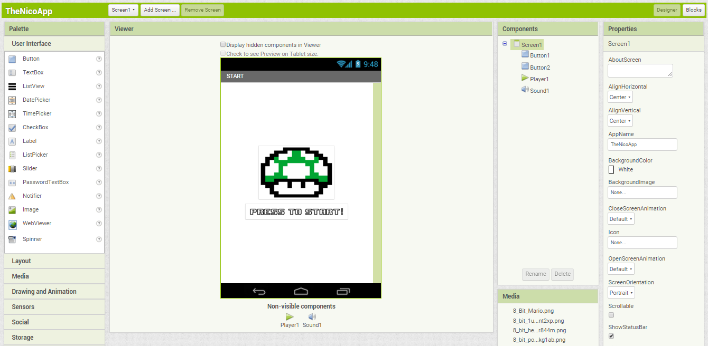
* Screen2
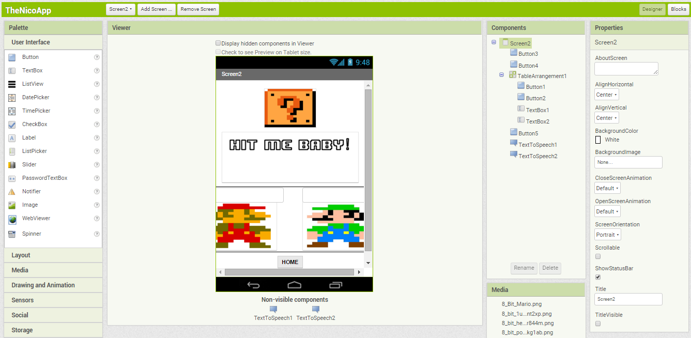

## Blocks Screenshots
* Screen1
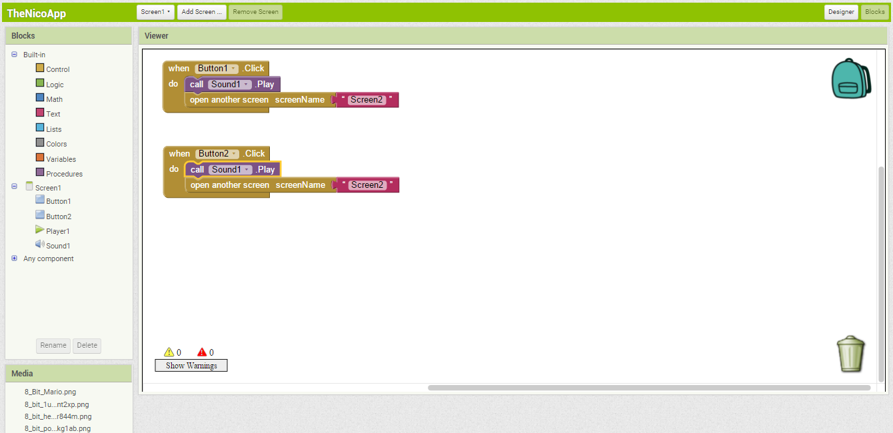
* Screen2
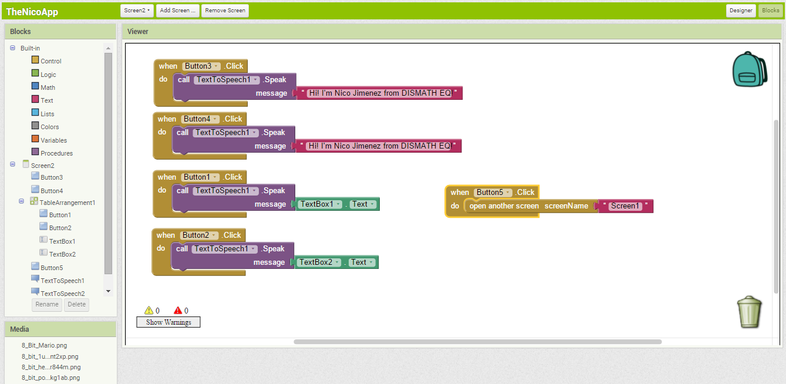

## Device Screenshots
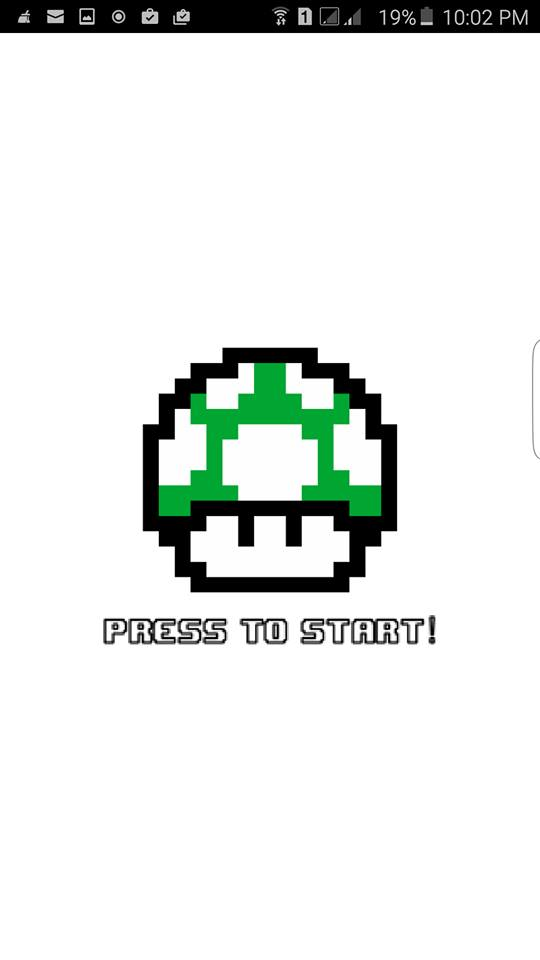
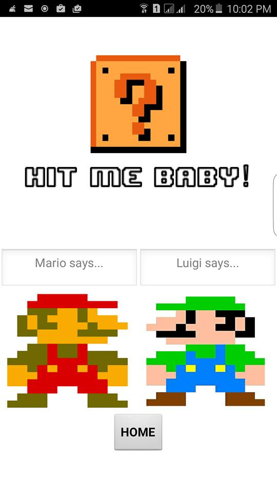

# DISMATH_ProjectBonus_nicojimenez

## Designer Screenshots
* Screen1
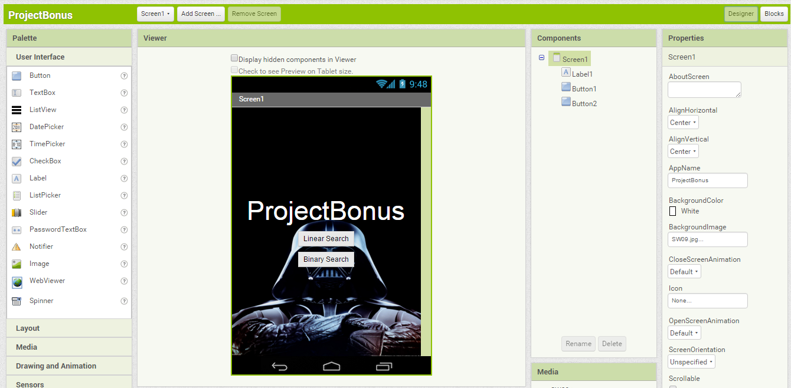
* Linear
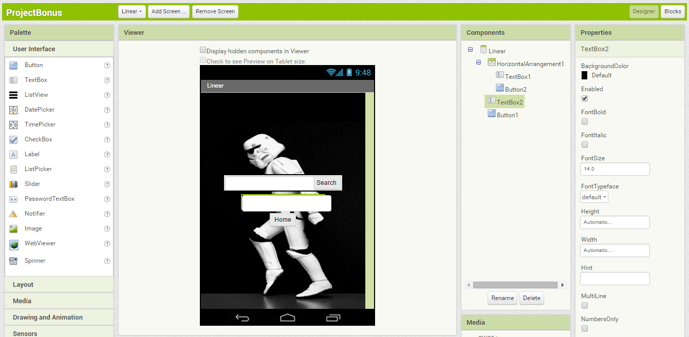
* Binary
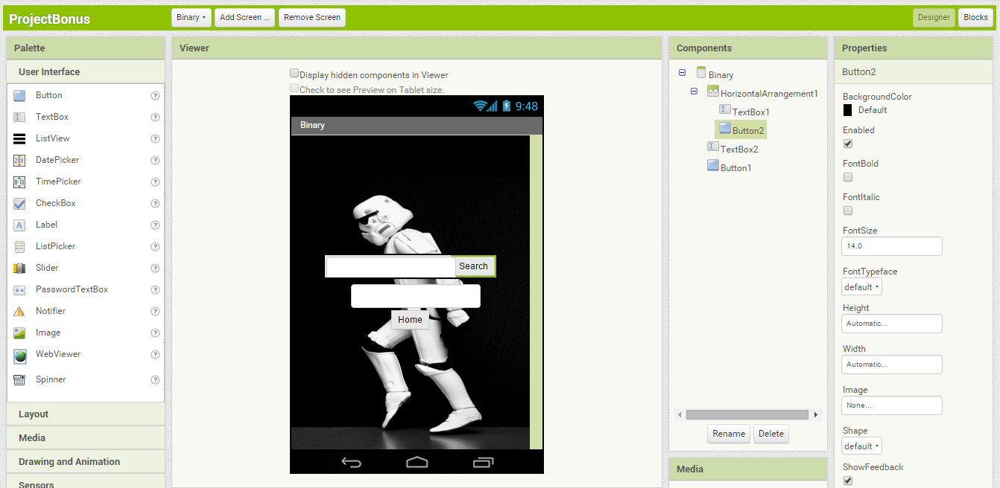

## Blocks Screenshots
* Screen1
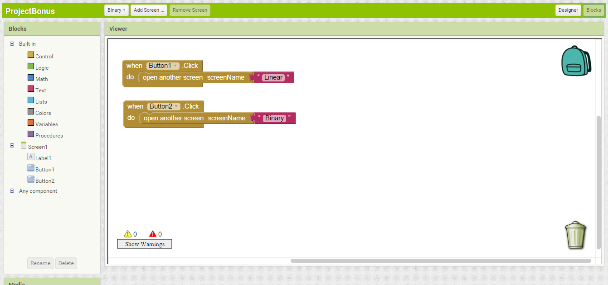
* Linear
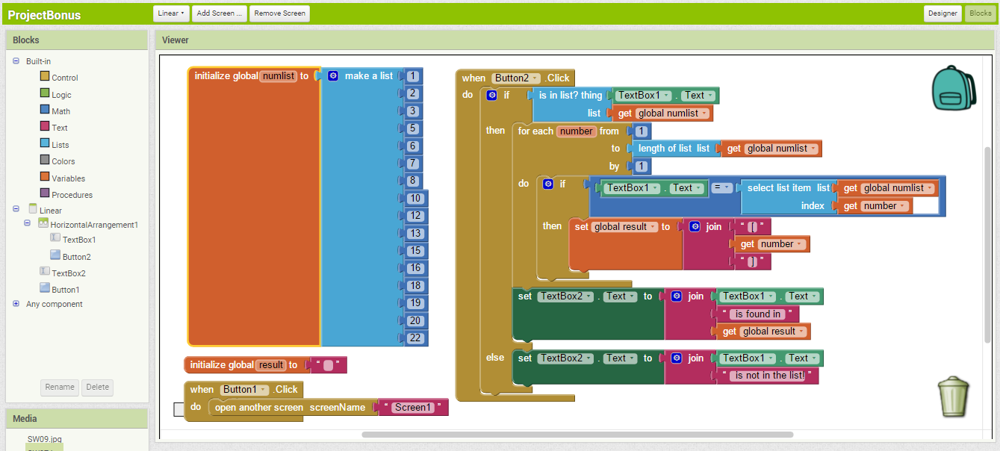
* Binary
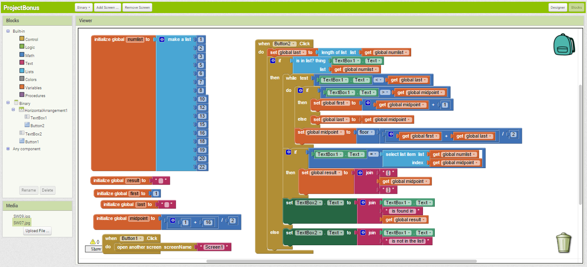

## Device Screenshots
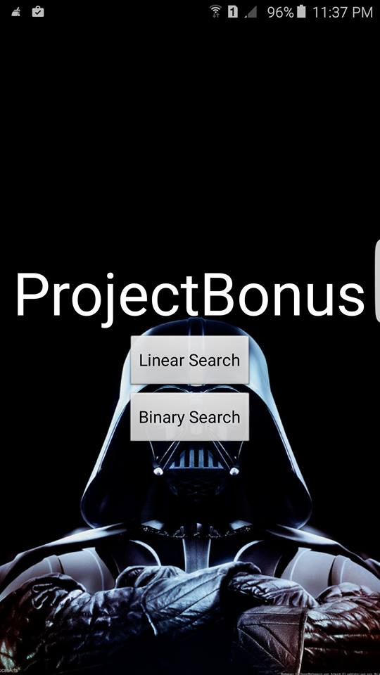
* Linear

* Binary
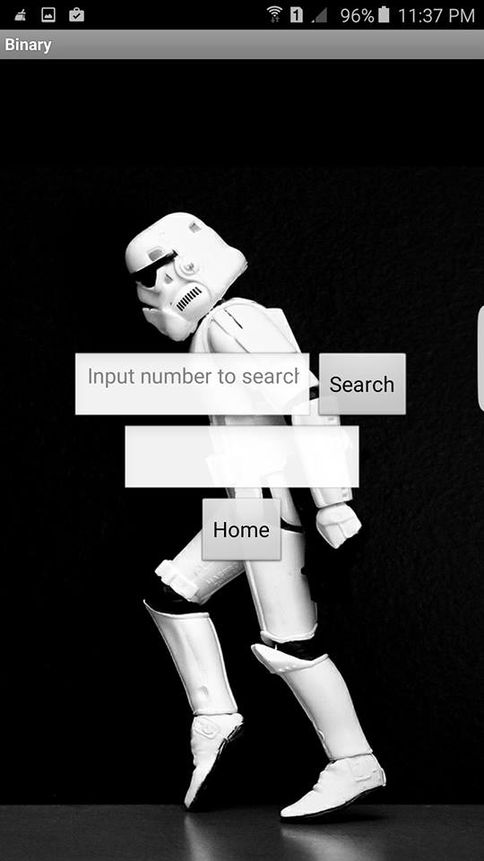
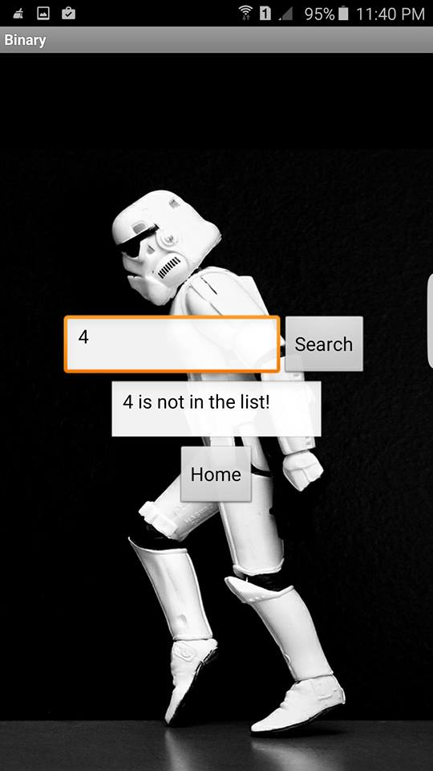
